# Is Tauri for me?

This is a question that the team has received on multiple occasions. It's a tricky question because while we would certainly love to say that Tauri is the best app framework out there and no matter what your use-case is Tauri can be used for it, that doesn't mean that it's necessarily the best framework for you to add to your tech stack. There are plenty of other app frameworks out there and if Tauri does not synergize with your talents and tech stack it might be better for you to select something else. We actively try to make the barrier for entry into Tauri as low as possible, but sometimes it's just not the right fit for your project.

So before you choose Tauri we need to be open and transparent about what app frameworks our colleagues in the field offer and make an open and honest comparison against them, after which you can ask yourself questions whether or not you feel like Tauri is the right fit for your project.

> I'll try to make this as unopinionated as possible, but I would just like it noted here that my personal opinion of Tauri as a framework is that it's an excellent way of developing a frontend for a Rust app, as opposed to being used as a backend for your non-Rust project. I support our efforts to make the framework as inclusive as possible while also not necessarily thinking it's all that appropriate to choose Tauri if you have no intention of learning Rust, or are willing to redevelop your existing backend in Rust as opposed to, as some users do, sidecar things like Node.js and Python into it. Those languages have their own frameworks you can use and using them through Tauri is often more trouble than it's worth.

## Outline

- Native or Web Technologies?
    - Do you need deep OS integration?
    - Maybe touch on cross-platform support here?
- SSR vs. SSG
    - Whats the difference
    - Why Tauri chose it's path
- Application logic / Backend (Rust, TypeScript, Go, etc.)
    - Lorenzo: I'd call this application logic instead of backend
    - Do you want it in Rust or JS/TS? We've got you covered. Others? Stay tuned (future bindings?)
    - Cover the Tech Stack heading you have below
- Feature, Features, Features!
    - Go through that lower-level detail of feature comparison (focusing on functional features)
    - Cover the Features heading you have below
- What makes Tauri different?
    - Cover security, efficiency, privacy, etc.
    - Include the points you have in the Security heading below

**Notes:**

- How to position this for a new project vs. an existing project?
- Any additional notes in https://github.com/tauri-apps/tauri-docs/issues/692

## Comparisons

Numbers don't lie, so here are the facts and figures for various alternatives to Tauri.

### Features

|                           | Tauri | Electron | Notes                                          |
|:------------------------- |:----- |:-------- | ---------------------------------------------- |
| **Browser support**       | ❌    | ❌       | I'd love to see what this looks like for Tauri |
| **Mobile support**        | ✅    | ❌       |                                                |
| **Updater**               | ✅    | ✅       |                                                |
| **Github Action**         | ✅    | ✅       |                                                |
| **Sidecar**               | ✅    | ❔       |                                                |
| **Notifications**         | ✅    | ❔       |                                                |
| **Plugins**               | ✅    | ❔       |                                                |
| **Installer**             | ✅    | ❔       |                                                |
| **Dev Container**         | ✅    | ❔       |                                                |
| **Alternative renderers** | ❌    | ❔       |                                                |
| **One-time commands**     | ❌    | ❔       |                                                |
| **Channel API**           | ❌    | ❔       |                                                |
| **FFI Bindings**          | ❌    | ❔       |                                                |
| **License**               | MIT   | ❔       |                                                |

### Tech stack

||Tauri|Electron|
|:--|:--|:--|
|**Frontend**|Web|Web|
|**Backend**|Rust/JS|Node.js|

### Benchmarks

||Tauri|Electron|
|:--|:--|:--|
|**Size**|600KB||
|**Frontend**|Varies based on webview used|All platforms use Chromium|
|**Backend**|Blazingly fast||

### Security

#### End user security

**Tauri** is audited by an external company. Since it's a newer project it is also a smaller target for hackers, meaning less effort is being made to hack it as compared to larger projects.
**Electron** is used by a lot of people. As such there is a much larger interest from the hacking community to tear it apart.

#### Developer security

**Tauri** offers an isolation pattern that protects developers from malicious Javascript in the frontend, and crates.io is currently one of the package repositories with the least malicious code in it.
**Electron** offers ?

### Community

**Tauri** has a small but active Discord community.
**Electron** has a large community.

### Customization

**Tauri** is highly customizable in terms of the backend, but the frontend is currently fixed in terms of which webview is used across its platforms. Alternative renderers are being worked on but are still not available.
**Electron** is less customizable in general, but offers fairly consistent performance across its platforms since they bundle their webview with the app.

## Decision flowchart

```mermaid
flowchart TD
    Start[Start] --> WebTech{Is your team familiar\nwith web development?}
    WebTech --> |Yes| Browser{Do you require\nbrowser support?}
    WebTech --> |No| Egui{Can your team use Egui?}
    Egui --> |Yes| BackendLanguage{Are you willing to develop\nyour backend in Rust and/or\nis the Tauri JS API\nsufficient for your project?}
    Egui --> |No| EguiEx
    EguiEx[Tauri doesn't offer any other alternatives]
    Browser --> |Yes| Wasm{Can you develop your own\nWASM library for your\nfrontend that acts as\na glue library between web\ntech and the Tauri API?}
    Browser --> |No| PreferFramework{Do you have a preferred\nfrontend framework?}
    Wasm --> |Yes| PreferFramework
    Wasm --> |No| WasmEx
    WasmEx[Tauri doesn't support WASM directly]
    PreferFramework --> |Yes| PreferFrameworkSSR{Does the framework\nuse SSR?}
    PreferFramework --> |No| PFCodeCentric{Do you prefer a more\ncode centric approach?}
    PFCodeCentric --> |Yes| PFTypescript{Do you want to develop\n using Typescript?}
    PFCodeCentric --> |No| PFCodeCentricNo
    PFCodeCentricNo[Svelte, SvelteKit, Vue, Nuxt] --> BackendLanguage
    PFTypescript --> |Yes| PFTypescriptYes
    PFTypescriptYes[Solid.js, React, Next] --> BackendLanguage
    PFTypescript --> |No| PFTypescriptNo
    PFTypescriptNo[Yew, Sycamore] --> BackendLanguage
    PreferFrameworkSSR --> |Yes| PreferFrameworkSSRExYes
    PreferFrameworkSSRExYes[Tauri doesn't support using\nSSR for the frontend]
    PreferFrameworkSSR --> |No| PreferFrameworkSSRExNo
    PreferFrameworkSSRExNo[As long as the framework\nsupports static hosting\nyou should be good to go] --> BackendLanguage
    BackendLanguage --> |Yes| UpgradeExisting{Do you have an existing project\nyou are trying to upgrade by using\nTauri?}
    BackendLanguage --> |No| BLScripted{Do you want to develop\nyour backend\n in Node.js, Python or any\nscripted language?}
    BLScripted --> |Yes| BLRestAPI{Are you willing to expose your backend\nthrough a REST API?}
    BLScripted --> |No| BLCoded{Are you willing to use FFI?}
    BLCoded --> |Yes| UpgradeExisting
    BLCoded --> |No| BLRestAPI
    BLRestAPI --> |Yes| UpgradeExisting
    BLRestAPI --> |No| BLRestAPIEx
    BLRestAPIEx[These are the only ways\nyou can use non-Rust\nlanguages in Tauri]
    UpgradeExisting --> |Yes| UEIsItFront{Is it your web based frontend\nyou want to enhance the\nperformance of?}
    UpgradeExisting --> |No| MobileSupport{Are you choosing Tauri\nfor its mobile support?}
    UEIsItFront --> |Yes| UEIsItFrontEx
    UEIsItFrontEx[Bad code is bad code and your frontend wont be noticably different\nsince what Tauri offers is based on system installed webviews. Look into improving your\ncode quality instead or switching frontend framework/libraries]
    UEIsItFront --> |No| MobileSupport
    MobileSupport --> |Yes| MobileSupportAlpha{Do you require something that's\nproduction ready anytime\nsoon?}
    MobileSupport --> |No| GameDev
    MobileSupportAlpha --> |Yes| MobileSupportAlphaEx
    MobileSupportAlphaEx[Mobile support is still in Alpha]
    MobileSupportAlpha --> |No| GameDev{Are you developing a game?}    
    GameDev --> |Yes| GameDevWebTech{Are you using web tech for your game?}
    GameDev --> |No| JobMarket{Is the job market a factor\nfor you?}
    GameDevWebTech --> |Yes| JobMarket
    GameDevWebTech --> |No| GameDevWebTechEx
    GameDevWebTechEx[Tauri doesn't support giving you\na native graphical context\nYou should probably look\ninto Bevy for game\ndevelopment in Rust]
    JobMarket --> |Yes| JobMarketEx
    JobMarketEx[Tauri is still young and the likelihood of being hired\nnot just as a Tauri developer but a Rust\ndeveloper at all is still fairly slim.]
    JobMarket --> |No| PickTauri
    PickTauri[Pick Tauri!!]
  

```

<a href="https://github.com/simonhyll/framework-flowcharts" target="_blank">(Click here for a better view of the chart)</a>

## Here are some questions to ask yourself

### Does your existing project have a backend you are willing to redevelop?

If you have developed a backend for e.g. an Electron based project you should be aware of that the backend you develop in Electron is Node.js. Tauri does not support running Node.js directly. The closest thing you get to it is currently by using a `sidecar` for the Node.js binary and then expose your backend through an API such as `express`.

The same goes for any non-Rust project you have. If you have a Python backend, then you'll need to redevelop it in Rust for it to work, or `sidecar` Python into your project and expose it through a locally running REST API.

I would say that if you are unwilling to redevelop your backend from other languages into Rust then Tauri may not be for you.

**That being said** it's important to also point out that the Tauri JS API will, for a lot of projects, be all you really need in terms of native functionality, and combined with the nowadays fairly powerful webviews that Tauri offers there's no reason why you can't make a project solely in Javascript. If you have an Electron app and all you do in the Node.js side is write to files, then the Tauri API can be used in your frontend without you ever having to touch a single line of Rust. It's a perfectly valid way of using Tauri, so before you decide not to use Tauri just because I recommend redeveloping your backend in Rust, take a look at the [Tauri JS API](https://tauri.app/v1/api/js/) to see if it offers the functionalities your app requires.

### Does your frontend framework support static hosting?

Tauri does not support running your frontend as a Server Side Rendered (SSR) website. If you have developed your current frontend in something like Flask then you're going to have to figure out how to compile that frontend into a Static Site Generated (SSG) and/or Single Page App (SPA).

If this terminology confuses you just ask yourself this: does your frontend get compiled into a folder with some combination of HTML/CSS/JS that you could upload to e.g. an Apache or Nginx server and have it fully functional? If not odds are that you are using SSR and it won't be compatible with Tauri.

**That being said** most frameworks support switching from SSR to SSG/SPA and you should look into that before you decide that the inability to re-use your exact current frontend code is a deal breaker.

### What is your current tech stack and does Tauri's tech stack fit into it or on top of it?

This question is primarily targeted at people with an existing project they want to port to Tauri, but it's also relevant to ask yourself.

Here's some sort of breakdown for a couple of frameworks so that you can compare their tech stacks. Note that their capabilities may differ greatly, it's mostly just to illustrate what your tech stack might look like and how a transition to Tauri might work for you.

|*Languages*|Tauri|Electron|Flask|
|:---|:---|:---|:---|
|**Frontend**|HTML|HTML|Python|
|**Styling**|CSS|CSS|Python|
|**Code**|JS/TS|JS/TS|Python|
|**Backend**|Rust+JS|Node.js|Python|

As you can see, from Electron the only real change is that you're going from Node.js to Rust+JS for backend coding. Since Node.js is essentially just Javascript you won't have to learn anything new to use Tauri as long as the Tauri JS API is sufficient for your app, but you also have the option to learn Rust to empower your app further.

When you come from Flask however you can see a much bigger difference in the tech stack, namely that Flask uses Python at every layer of its tech stack. This is good for Flask in the sense that you don't have to learn multiple languages to develop with it. The bad news though is that it doesn't synergize well with the Tauri tech stack since you'll have to learn a new language for every single layer.

**That being said** Tauri gives you the full power of Rust and friendship, and as such you are capable of developing anything you can imagine with it. It might not always be in the way you want, but regardless of what your app does right now it's not a matter of whether Tauri is capable of doing it, just how it's done and whether you're willing to learn how to do it.

## Alternatives to Tauri

Here's a list of alternatives to Tauri (generated by ChatGPT):

**Electron**: Electron is a framework for building cross-platform desktop applications using web technologies such as HTML, CSS, and JavaScript.

**Proton Native**: Proton Native is a React-based framework for building desktop applications using native components.

**NW.js**: NW.js is a framework for building desktop applications using web technologies such as HTML, CSS, and JavaScript.

**Qt**: Qt is a cross-platform application development framework for building desktop and mobile applications using C++ and QML.

**Flutter Desktop**: Flutter Desktop is an experimental framework for building desktop applications using the Flutter framework, which is based on the Dart programming language.

**React Native Desktop**: React Native Desktop is a framework for building desktop applications using the React Native framework.

**AvaloniaUI**: AvaloniaUI is a cross-platform application development framework for building desktop applications using XAML and .NET.

**Gtk+**: Gtk+ is a cross-platform toolkit for building graphical user interfaces using the C programming language.

**JavaFX**: JavaFX is a cross-platform framework for building desktop and mobile applications using the Java programming language.

**WxWidgets**: WxWidgets is a cross-platform toolkit for building graphical user interfaces using C++, Python, and other programming languages.

**Nativefier**: Nativefier is a command-line tool that allows you to create native desktop applications from any web page using web technologies such as HTML, CSS, and JavaScript.

**XULRunner**: XULRunner is a runtime environment for building desktop applications using the Mozilla XUL (XML User Interface Language) language and web technologies such as HTML, CSS, and JavaScript.

**CEF (Chromium Embedded Framework)**: CEF is a cross-platform framework for embedding the Chromium web browser into desktop applications using web technologies such as HTML, CSS, and JavaScript.

**Sciter**: Sciter is a lightweight, cross-platform framework for building desktop applications using HTML, CSS, and script languages such as JavaScript, TypeScript, and Python.

**OpenFin**: OpenFin is a secure desktop operating system that allows you to build and deploy web-based applications on the desktop.

**JUCE**: JUCE is a cross-platform framework for building audio applications, plugins, and graphical user interfaces using C++.

**SDL**: SDL is a cross-platform framework for building multimedia applications and games using the C programming language.

**Godot Engine**: Godot Engine is a cross-platform game engine and application development framework that uses its own scripting language called GDScript.

**Kivy**: Kivy is a cross-platform framework for building multitouch applications and games using the Python programming language.

**Xamarin.Forms**: Xamarin.Forms is a cross-platform UI toolkit for building mobile and desktop applications using the .NET framework and C#.

**Reactron**: Reactron is a framework for building cross-platform desktop applications using web technologies such as React, Node.js, and Electron.

**Ultralight**: Ultralight is a lightweight, cross-platform framework for building desktop applications using web technologies such as HTML, CSS, and JavaScript.

**WebView2**: WebView2 is a runtime environment for building desktop applications using web technologies such as HTML, CSS, and JavaScript, powered by the Microsoft Edge web engine.

**PySide**: PySide is a Python binding for the Qt framework, allowing you to build cross-platform desktop applications using Python.

**WinUI**: WinUI is a native user interface (UI) framework for building desktop applications on Windows using web technologies such as HTML, CSS, and XAML.

**Apache Royale**: Apache Royale is an open-source framework for building cross-platform desktop and mobile applications using web technologies such as HTML, CSS, and JavaScript.

**wxPython**: wxPython is a Python binding for the wxWidgets cross-platform toolkit, allowing you to build desktop applications using Python.